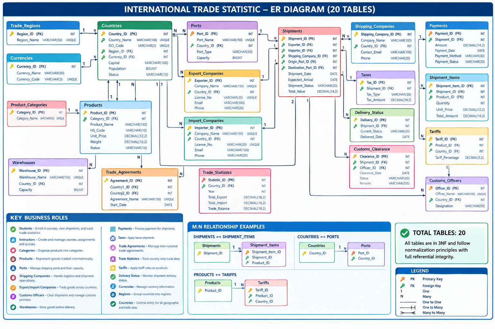

# International Trade Statistics Analysis using MySQL

## 📌 Project Overview

This project focuses on analyzing international trade data using **MySQL**. The database contains information about countries, products, ports, exporters, importers, shipments, payments, customs clearance, taxes, and trade statistics.

The main goal of this project is to use SQL to understand trade activities and answer practical business questions related to **shipment value, company performance, product activity, payments, customs, delivery, and country-level trade trends**.

The project uses a relational database with **20 connected tables** and a large dataset containing thousands of trade-related records.

---

## 🎯 Project Objectives

- Analyze international trade activities using SQL.
- Understand relationships between different trade entities.
- Analyze exporter and importer performance.
- Identify high-value products, shipments, and ports.
- Track payment and customs clearance status.
- Analyze delivery performance and shipment delays.
- Compare country-level import, export, and trade balance.
- Practice advanced SQL concepts using real-world data.

---

## 🗂️ Database Structure

The database contains 20 related tables:

1. `Trade_Regions`
2. `Currencies`
3. `Countries`
4. `Product_Categories`
5. `Products`
6. `Ports`
7. `Shipping_Companies`
8. `Export_Companies`
9. `Import_Companies`
10. `Warehouses`
11. `Customs_Officers`
12. `Tariffs`
13. `Shipments`
14. `Shipment_Items`
15. `Customs_Clearance`
16. `Payments`
17. `Taxes`
18. `Trade_Agreements`
19. `Delivery_Status`
20. `Trade_Statistics`

These tables are connected using **Primary Keys and Foreign Keys**, allowing trade information to be analyzed across multiple entities.

---

## 📊 Dataset

The project uses real-world trade-related data collected from a Kaggle dataset and organized into a relational MySQL database.

Some of the major datasets include:

| Data | Approximate Records |
|---|---:|
| Shipment Items | 65,000+ |
| Payments | 25,000 |
| Products | 800 |
| Ports | 300 |
| Customs Officers | 200 |
| Export & Import Companies | 500+ |
| Database Tables | 20 |

The dataset contains information such as shipment values, product prices, quantities, payment methods, payment status, customs status, port capacity, company details, delivery dates, and yearly trade statistics.

---

## 🛠️ Tech Stack

- **MySQL**
- **SQL**
- Joins
- Subqueries
- CTEs
- Aggregate Functions
- Window Functions
- Date Functions
- Data Aggregation

---

## 🖼️ Entity Relationship Diagram

The database relationships between the 20 tables are represented in the ER diagram below.

[](./ER_Diagram.png)

> **Note:** Keep `ER_Diagram.png` in the same folder as this `README.md` file.

---

## 🔍 SQL Analysis Performed

### Basic Data Analysis

- Retrieved active countries with their capital and population.
- Listed currencies and currency codes.
- Filtered products based on unit price.
- Identified ports based on capacity.
- Retrieved delivered shipments.
- Found pending payments.
- Filtered products using pattern matching.
- Identified countries containing specific keywords.

### Multi-Table Analysis

Used different table relationships to combine information from multiple tables.

Examples include:

- Countries with their trade regions.
- Countries with their currencies.
- Products with category names.
- Ports with their country names.
- Exporters and importers with their respective countries.
- Shipments with exporter and importer details.
- Shipments with origin and destination ports.
- Customs clearance details with customs officers.
- Shipment payments with payment status.

### Aggregation & Group Analysis

Used `SUM()`, `AVG()`, and `COUNT()` with `GROUP BY` and `HAVING` to analyze:

- Total countries in each region.
- Number of products in each category.
- Average product price by category.
- Total shipment value by shipping company.
- Total shipment value by exporter and importer.
- Total tax collected per shipment.
- Total payments received per shipment.
- Shipping companies handling more than 1,000 shipments.

### Advanced SQL Analysis

Used **subqueries and CTEs** for multi-step analysis.

Examples:

- Countries with population above the average population.
- Highest-priced product in each category.
- Exporters whose shipment value is above the average exporter shipment value.
- Countries with negative trade balance for multiple years.
- Top exporters within each country.

### Window Function Analysis

Used window functions for ranking and cumulative analysis.

Examples:

- Ranking products based on unit price.
- Finding the top products within each category.
- Ranking exporter companies based on shipment value.
- Finding top exporters within each country.
- Calculating running shipment value by date.
- Calculating year-wise running export value for each country.

### Shipment & Delivery Analysis

Analyzed shipment progress using shipment, customs, payment, and delivery information.

Examples:

- Shipments with pending payments and approved customs clearance.
- Shipments cleared by customs but not yet delivered.
- Most frequently used origin port.
- Average delivery time for delivered shipments.
- Shipments delivered later than the expected arrival date.
- Top origin ports based on shipment value.

### Country-Level Trade Analysis

Used the `Trade_Statistics` table to analyze:

- Yearly export values.
- Yearly import values.
- Trade balance.
- Countries where imports are greater than exports.
- Countries with negative trade balance for multiple years.
- Running export totals by country and year.
- Top countries based on total export and import values.

---

## 💡 Key Business Questions Answered

Some of the important questions answered using SQL include:

- Which countries have the highest total export value?
- Which countries have the highest total import value?
- Which products have the highest shipment value?
- Which exporters handle the highest shipment value?
- Which importers handle the highest shipment value?
- Which shipping companies handle more than 1,000 shipments?
- Which ports handle the highest shipment value?
- Which products are most frequently shipped?
- Which shipments have pending payments?
- Which shipments have cleared customs but are not delivered?
- Which shipments were delivered later than expected?
- Which countries have imports higher than exports?
- Which countries have a negative trade balance for multiple years?

---

## 📁 Project Files

```text
International-Trade-Statistics-Analysis/
│
├── README.md
├── ER_Diagram.png
│
├── database/
│   └── international_trade_statistic.sql
│
├── dataset/
│   ├── Trade_Regions.csv
│   ├── Currencies.csv
│   ├── Countries.csv
│   ├── Product_Categories.csv
│   ├── Products.csv
│   ├── Ports.csv
│   ├── Shipping_Companies.csv
│   ├── Export_Companies.csv
│   ├── Import_Companies.csv
│   ├── Warehouses.csv
│   ├── Customs_Officers.csv
│   ├── Tariffs.csv
│   ├── Shipments.csv
│   ├── Shipment_Items.csv
│   ├── Customs_Clearance.csv
│   ├── Payments.csv
│   ├── Taxes.csv
│   ├── Trade_Agreements.csv
│   ├── Delivery_Status.csv
│   └── Trade_Statistics.csv
│
└── queries/
    ├── International_Trade_Tables.sql
    ├── International_Trade_Queries.sql
    └── International_Trade_Select.sql
```

---

## 🚀 How to Run the Project

### 1. Create the Database

```sql
CREATE DATABASE international_trade_statistic;

USE international_trade_statistic;
```

### 2. Create the Tables

Run the table creation queries in the correct order because several tables contain foreign key relationships.

### 3. Load the Dataset

Import the CSV files into their respective tables.

### 4. Run the Analysis Queries

Open the SQL query files and execute the queries to perform the analysis.

---

## 📚 SQL Concepts Practiced

This project helped me work with:

- `SELECT`
- `WHERE`
- `ORDER BY`
- `LIKE`
- `BETWEEN`
- `JOIN`
- `LEFT JOIN`
- `GROUP BY`
- `HAVING`
- `SUM()`
- `AVG()`
- `COUNT()`
- `COALESCE()`
- Subqueries
- Correlated Subqueries
- CTEs
- Window Functions
- `RANK()`
- `PARTITION BY`
- Running Totals
- `CASE`
- `DATEDIFF()`
- `DATE_ADD()`

---

## 📈 Project Outcome

Through this project, I gained practical experience in working with a **large relational database** and writing SQL queries to solve real-world business questions.

The project helped me understand how to move from a business requirement to a SQL query, combine data from multiple tables, perform calculations, and use the results to identify useful trade and shipment insights.

---

## 👤 Author

**SelvaSankar M**
